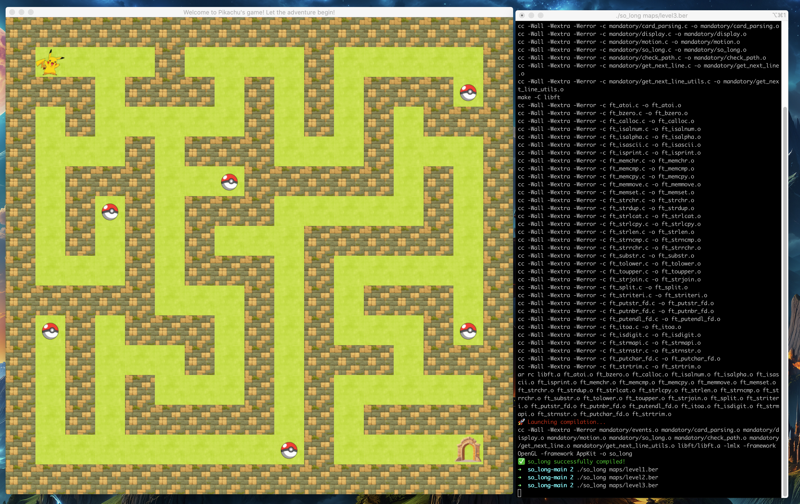

# Pikachu Maze Adventure - so_long

## 📝 Description

Pikachu Maze Adventure is a 2D game developed using the so_long framework from the 42 Network. The game starts with Pikachu as the main character, navigating through a labyrinth to collect all the Pokéballs before reaching the exit. The game has two versions:

Basic Version: No enemies—Pikachu can freely collect the Pokéballs and reach the exit.

Extended Version: Introduces enemies that move in a defined pattern. If Pikachu touches an enemy, the game is over, making the gameplay more challenging and competitive.

## 🎮 Gameplay

Objective: Collect all Pokéballs and reach the exit.

Controls:

- W || ⬆️ - Move Up

- A || ⬅️ - Move Left

- S || ⬇️ - Move Down

- D || ➡️ - Move Right

Enemies: Move in a fixed pattern and cause game over if touched.

Strategy: Avoid enemies while collecting all Pokéballs before heading to the exit.

## 🖼️ Screenshots

### Basic Version





### Extended Version (with Enemies)


## 🛠️ Features

Unique maze design inspired by a labyrinth.

Differentiated visuals between basic and extended versions.

A custom enemy movement algorithm that ensures fair gameplay.

A distinct art style compared to other similar so_long projects, avoiding the typical Pac-Man approach.

## 🛠️ Installation & Running

To play the game, clone the repository and compile it:
```zsh
git clone https://github.com/your-github-username/your-repository-name.git
cd your-repository-name
make
./so_long maps/level1.ber
./so_long maps/level2.ber
./so_long maps/level3.ber
./so_long maps/screen_size.ber
make bonus
./so_long_bonus maps/level1.ber
./so_long_bonus maps/level2.ber
./so_long_bonus maps/screen_size.ber
```

## 📌 Notes

The game follows the so_long project guidelines from the 42 Network.

Enemy movement is carefully designed to ensure they do not block the player from completing the game.

The game is designed with distinct colors and styles for better visual appeal.

## 📜 License

This project is for educational purposes and follows the 42 Network guidelines.

### Enjoy playing Pikachu Maze Adventure! ⚡🎮
